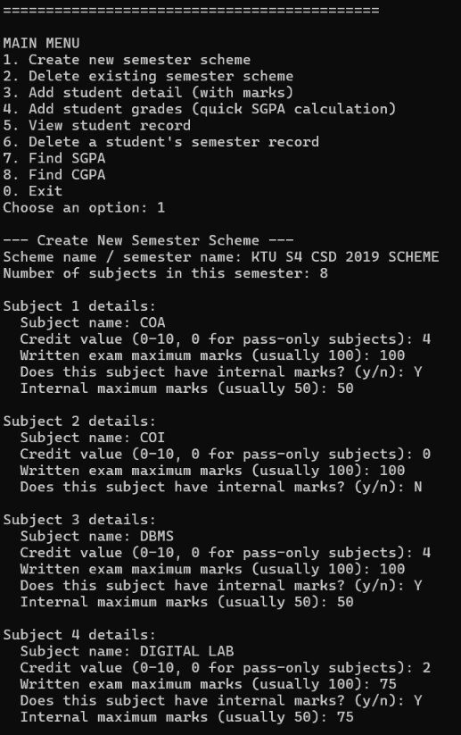
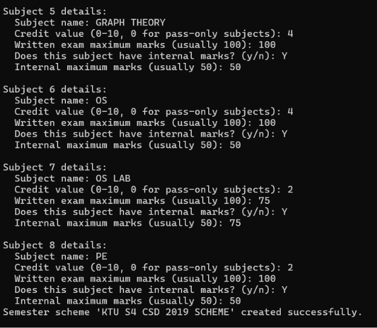
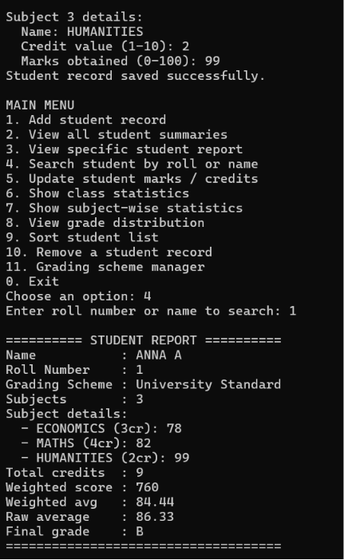

# KTU SGPA/CGPA Manager

KTU SGPA/CGPA Manager is a Java-based console application designed to manage and calculate semester-wise academic performance based on the KTU grading system.

It allows users to create semester schemes, manage student records, calculate SGPA and CGPA, evaluate grades automatically, track earned credits, and generate complete academic reports.

---

## Features

- Create custom semester schemes
- Add subjects with credits and mark structure
- Support for written and internal marks
- Automatic grade and grade-point calculation
- SGPA calculation using weighted credits
- CGPA calculation across multiple semesters
- Earned credit tracking
- Pass/fail validation system
- Quick grade-entry based SGPA calculation
- View complete student academic records
- Delete semester records and schemes
- Input validation and exception handling

---

## Tech Stack

**Language:**
- Java (Core Java)

**Concepts Used:**
- Object-Oriented Programming (OOP)
- Collections Framework (ArrayList)
- Exception Handling
- Modular Program Design
- Scanner-based Input Handling
- Dynamic Data Management
- Credit-based Academic Computation

---

## Project Structure

KTUSGPAManager/
├── Main.java
├── Student.java
├── SemesterRecord.java
├── SemesterScheme.java
├── SubjectTemplate.java
├── SubjectResult.java

---

## SGPA Formula

SGPA = Σ(Credit × Grade Point) ÷ Σ(Credits)

Only passed subjects are included in SGPA calculation.

---

## CGPA Formula

CGPA = Σ(All Credit × Grade Point) ÷ Σ(All Earned Credits)

Failed subjects are excluded from CGPA calculation.

---

## Pass Criteria

### Subjects with Internals
- Minimum 40% in written examination
- Minimum 35% in internal assessment

### Subjects without Internals
- Minimum 50% overall marks

---

## How to Run

### 1. Compile Java files

```bash
javac *.java
```

### 2. Run the program

```bash
java Main
```

---

## Screenshots







---

## Future Improvements

- File-based data storage system
- Database integration using MySQL
- GUI version using JavaFX
- Web-based version using Spring Boot
- Authentication system
- Export academic reports as PDF
- Student performance analytics dashboard

---

## Author

Harsha
